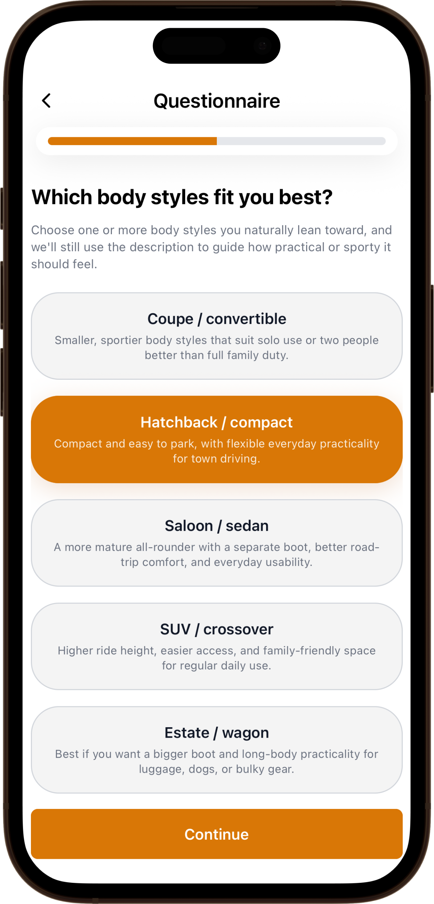
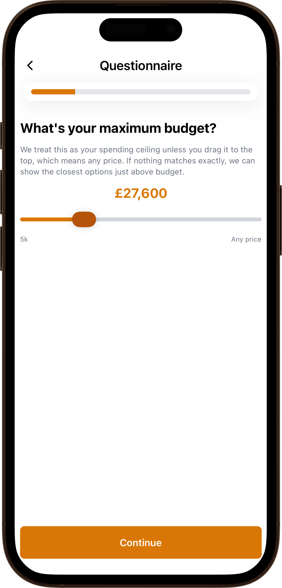
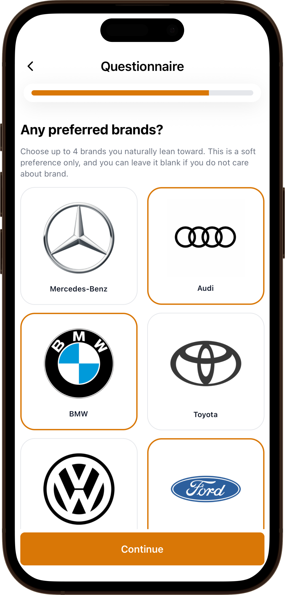
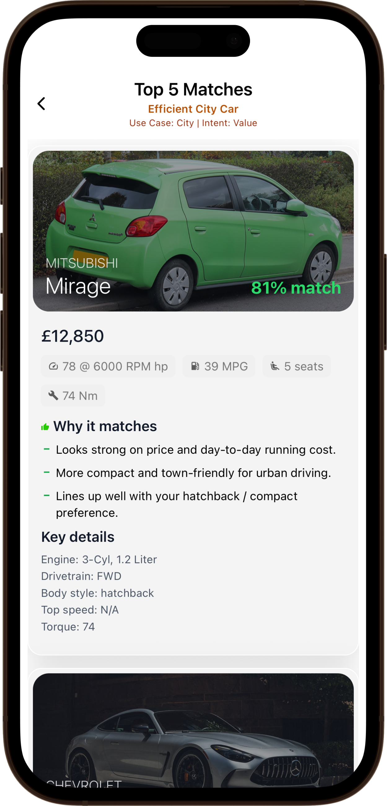
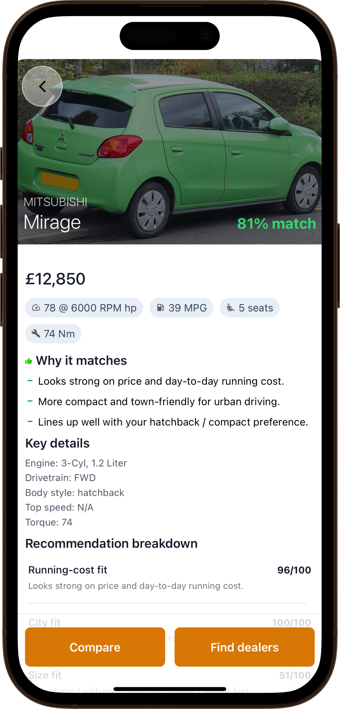
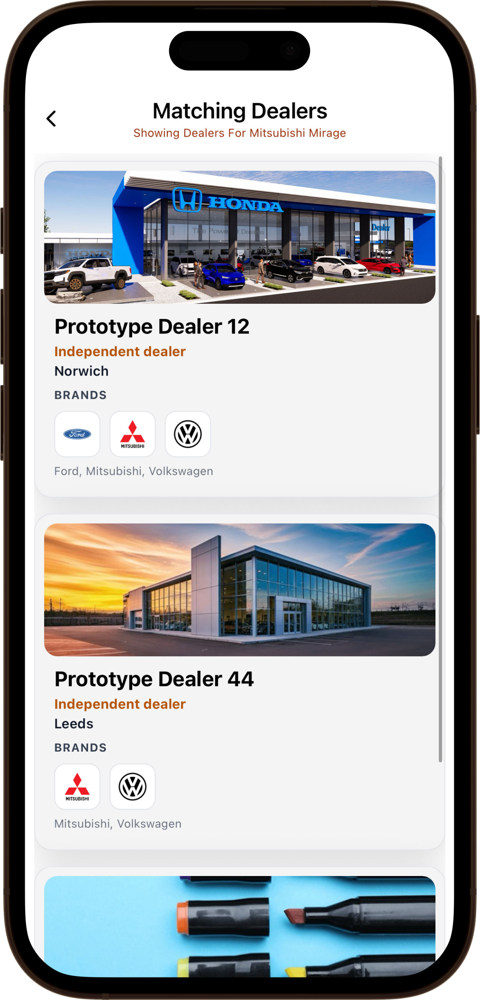
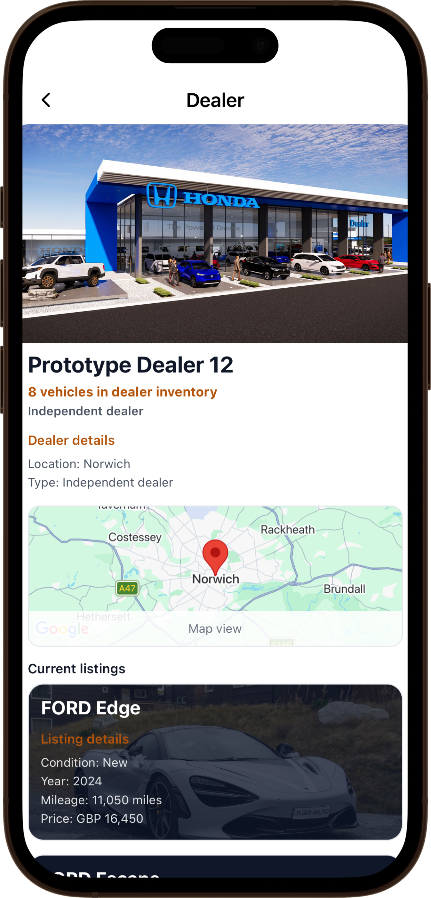
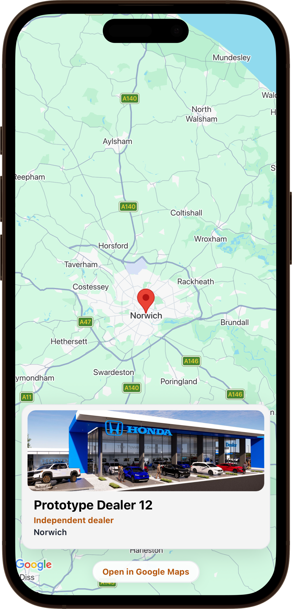
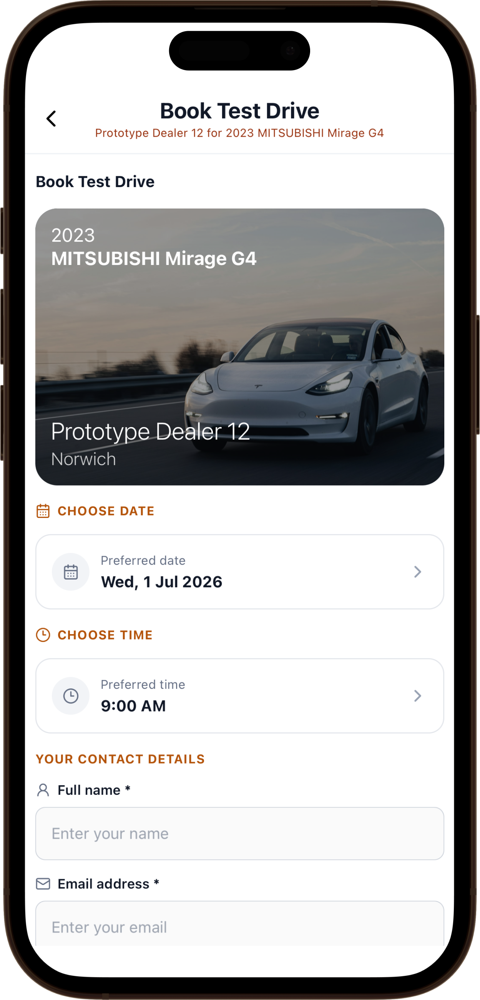

<!--
Hey, thanks for using the awesome-readme-template template.
If you have any enhancements, then fork this project and create a pull request
or just open an issue with the label "enhancement".

Don't forget to give this project a star for additional support ;)
Maybe you can mention me or this repo in the acknowledgements too
-->
<div align="center">
  <h1>Car Recommendation Application</h1>
<br/>
</div>
<!-- Table of Contents -->

# Table of Contents

- [How the app works](#how-the-app-works)
- [Recommendation Algorithm](#recommendation-algorithm)
- [Tech Stack](#tech-stack)
- [Get started](#get-started)
- [Learn more](#learn-more)
- [Usage](#usage)
- [Contact](#contact)
- [Acknowledgements](#acknowledgements)

<!-- About the Project -->

# How the app works

<!-- Screenshots -->

<div>
<h1>1. Questionnaire</h1>
<p>To help you find a vehicle that fits their needs, a questionnaire is used to detirmine what vehicle features and characteristics you are most likely to require in your new car.</p>
</div>

<div>
  
  
  
</div>

<div>
<h1>2. Recommendation List</h1>
<p>Cars that fit your requirements are listed from best to worst. The benifits are listed without using technical terminology, so that all types of users can understand the reason for the recommendation</p>



</div>

<div>
<H1>3. Direct Link to Dealership</H1>
<p>The application stores a list of dealerships in it's database. Any dealership that one of the recommended vehciles are listed to the user to choose from.</p>



</div>

<div>
<h1>4. Book and reserve test drives</h1>
<p>Found the exact car you want? register for a test drive from within the application, where the dealer will keep in touch</p>

</div>

<!-- Recommendation Algorithm -->

# Recommendation Algorithm

The recommendation algorithm is split across three modules so that the user profile, scoring configuration and vehicle scoring can be tested separately:

- [recommendationService.js](API/services/recommendationService.js) builds the user profile and passes database results into the scorer.
- [recommendationConfig.js](src/ScoringConfigs/recommendationConfig.js) holds the weights and thresholds, making the recommendation output tuneable through variable changes.
- [recommendationScoring.js](src/ScoringConfigs/recommendationScoring.js) calculates the final match score for each vehicle.

The scoring values are normalised between `0` and `1`, where `1` represents a full match and `0` represents no match. This lets the UI display the result as a match percentage while the backend keeps the calculation simple.

# 1. Questionnaire answers become a driver profile

Rather than asking novice buyers to manually apply technical filters, the questionnaire converts everyday answers into a practical use case and ownership intent. The highest scoring bucket becomes the primary profile, with deterministic tie-break ordering from the config.

```js
// API/services/recommendationService.js
const scoreRuleGroups = (rules = {}, answers = {}) => {
  const scores = {}; // Stores running totals, e.g. { city: 6, weekend: 1 }.

  Object.entries(rules).forEach(([questionKey, optionRules]) => {
    toSelections(answers[questionKey]).forEach((selection) => {
      // Handles single and multi-select answers.
      addScores(scores, optionRules[selection] || {}); // Valid answers add points; unknown ones add nothing.
    });
  });

  return scores; // Returns the completed score bucket for this rule group.
};

const determineUseCase = (answers = {}) => {
  const scores = scoreRuleGroups(USE_CASE_RULES, answers); // Converts answers into use-case scores.
  const result = buildCategoryResult(scores, USE_CASE_ORDER, DEFAULT_USE_CASE); // Picks the winner.

  return {
    useCase: result.key, // The winning driver profile, such as "city".
    useCaseScores: result.scores, // Raw scores are useful for debugging.
    useCaseBlend: result.normalizedScores, // Normalised scores show profile strength.
  };
};
```

Example rule groups from the config:

```js
// src/ScoringConfigs/recommendationConfig.js
const USE_CASE_RULES = {
  drive_style: {
    q1_city: { city: 3 }, // A city-driving answer strongly favours city cars.
    q1_long_distance: { long_distance: 3 }, // Long journeys favour motorway comfort.
    q1_mixed: { city: 1.5, long_distance: 1.5 }, // Mixed use splits the points.
    q1_weekend: { weekend: 3 }, // Weekend driving favours more enjoyable cars.
  },
  usage_pattern: {
    q8_commute: { long_distance: 2.5, city: 0.5 }, // Commutes lean toward efficiency.
    q8_errands: { city: 3 }, // Short local trips favour a compact city profile.
    q8_roadtrips: { long_distance: 3, weekend: 1 }, // Road trips value distance comfort.
    q8_work: { work: 3 }, // Work usage favours practicality.
    q8_family: { family: 3 }, // Family usage favours space and safety.
  },
};
```

# 2. Use case weights stay tuneable

The base weights define what matters most for each type of driver. For example, a city profile leans toward running cost, city suitability and size, while a weekend profile gives more importance to performance.

```js
// src/ScoringConfigs/recommendationConfig.js
const USE_CASE_BASE_WEIGHTS = {
  city: {
    runningCostFit: 0.34, // Running cost matters most for city users.
    cityFit: 0.28, // Rewards cars suited to stop-start urban driving.
    sizeFit: 0.18, // Smaller cars are easier to park and manoeuvre.
    spaceFit: 0.12, // Space still matters, but it is not the main priority.
    comfortFit: 0.08, // Comfort is useful, but weighted lower for city use.
  },
  weekend: {
    performanceFit: 0.44, // Weekend cars are weighted heavily toward fun.
    comfortFit: 0.14, // Keeps longer leisure drives comfortable.
    brandFit: 0.14, // Lets preferred brands influence emotional choices.
    runningCostFit: 0.08, // Cost matters, but less than performance here.
    cityFit: 0.06, // Urban suitability is a minor bonus.
    spaceFit: 0.06, // Space is useful, but not central to this profile.
    practicalFit: 0.08, // Practicality prevents unusable recommendations.
  },
};
```

Intent and smaller questionnaire nudges are then applied on top of the base profile. This means the algorithm can still recommend a city car, but adjust the ranking if the user asks for performance, comfort, practicality or lower running costs.

```js
// API/services/recommendationService.js
const applyWeightModifiers = (baseWeights = {}, answers = {}, intent) => {
  const weights = { ...baseWeights }; // Copy first so the base config is not mutated.

  addScores(weights, INTENT_WEIGHT_MODIFIERS[intent] || {}); // Adds the intent nudge.

  Object.entries(QUESTION_WEIGHT_MODIFIERS).forEach(
    ([questionKey, optionModifiers]) => {
      if (questionKey === "preferred_brands") {
        if (toSelections(answers.preferred_brands).length) {
          addScores(weights, optionModifiers.__selected__ || {}); // Brand is a soft boost.
        }
        return;
      }

      toSelections(answers[questionKey]).forEach((selection) => {
        addScores(weights, optionModifiers[selection] || {}); // Nudges the final priorities.
      });
    },
  );

  return normalizeWeights(weights); // Keeps the final weights in a clean 0..1 shape.
};
```

# 3. Cars are scored relative to the active shortlist

The algorithm compares vehicles against the current shortlist, not against hardcoded metadata for every vehicle. This keeps the recommendations flexible when the database grows, and supports plain-English descriptions such as whether a car is smaller, cheaper or more performance-focused than the other available matches.

```js
// src/ScoringConfigs/recommendationScoring.js
const buildRanges = (cars = []) => {
  const metricGetters = {
    price: (car) => getComparableMetricValue("price", car), // Lower is better for value.
    efficiency: (car) => getComparableMetricValue("efficiency", car), // Higher is cheaper to run.
    horsepower: (car) => getComparableMetricValue("horsepower", car), // Higher helps performance.
    acceleration: (car) => getComparableMetricValue("acceleration", car), // Lower 0-60 is quicker.
    seating: (car) => getComparableMetricValue("seating", car), // More seats help family use.
    bootSpace: (car) => getComparableMetricValue("bootSpace", car), // More boot space helps practicality.
    curbWeight: (car) => getComparableMetricValue("curbWeight", car), // Lower weight helps city/performance fit.
  };

  return Object.fromEntries(
    Object.entries(metricGetters).map(([key, getter]) => {
      const values = cars
        .map((car) => getter(car))
        .filter((value) => value !== null); // Ignore missing values so sparse data still works.
      if (!values.length) return [key, null]; // No usable data means this metric is skipped.

      return [key, { min: Math.min(...values), max: Math.max(...values) }]; // Creates the shortlist range.
    }),
  );
};
```

Each weighted metric produces a fit value and a contribution. The final `matchScore` is the sum of those weighted contributions.

```js
// src/ScoringConfigs/recommendationScoring.js
const scoreCar = (car, meta = {}) => {
  const metricResults = Object.entries(weights)
    .filter(([, weight]) => Number.isFinite(weight) && weight > 0) // Only active metrics are scored.
    .map(([metricKey, weight]) => {
      const builder = METRIC_BUILDERS[metricKey]; // Finds the scoring logic for this metric.
      if (!builder) return null; // Unknown metrics are ignored safely.

      const fit = clamp(
        builder.getScore(car, {
          criteria,
          ranges,
        }) ?? 0.5,
      ); // Fit is clamped between 0 and 1 so scores stay valid.

      return {
        key: metricKey,
        label: builder.label,
        weight,
        fit,
        contribution: fit * weight, // This is how much the metric adds.
        note: builder.getNote(car, { criteria, ranges }, fit), // Plain-English UI reason.
      };
    })
    .filter(Boolean);

  const score = Number(
    metricResults
      .reduce((total, result) => total + result.contribution, 0) // Sum all weighted metrics.
      .toFixed(4),
  );

  const recommendationBreakdown = buildBreakdown(
    metricResults,
    score,
    priorityKeys,
  ); // Builds the rows shown in the recommendation explanation.

  return {
    ...car,
    score,
    matchScore: score, // Same value exposed under the API/UI naming.
    recommendationBreakdown,
    topReasons: buildTopReasons(recommendationBreakdown),
    useCase: meta.useCase,
    intent: meta.intent,
    profileLabel: meta.profileLabel,
  };
};
```

# 4. Results are filtered, ranked and explained

Hard filters such as budget, fuel and transmission are applied before scoring. After that, the scorer orders the shortlist from strongest to weakest match, removes results below the configured threshold, and returns a breakdown that the UI can explain without relying on dense vehicle statistics.

```js
// API/services/recommendationService.js
const recommendCars = (cars = [], answers = {}, limit = 5) => {
  const { useCase, useCaseScores, useCaseBlend } = determineUseCase(answers); // Finds what the car is for.
  const { intent, intentScores } = determineIntent(answers); // Finds what the buyer values.
  const profileLabel = getProfileLabel(useCase, intent); // Human-readable UI label.
  const { baseWeights, useCaseWeightBlend } = getBaseWeightsForUseCase(
    useCase,
    useCaseScores,
  ); // Turns the profile into base scoring priorities.
  const weights = applyWeightModifiers(baseWeights, answers, intent); // Applies final answer-based tweaks.
  const { criteria: requestedCriteria, dbFilters } =
    translateAnswersToHardFilters(answers); // Converts explicit choices into hard filters.
  const {
    criteria: supportedCriteria,
    criteriaAdjustments: supportAdjustments,
  } = adjustUnsupportedCriteria(cars, requestedCriteria); // Removes filters the data cannot support.
  const {
    criteria,
    criteriaAdjustments: emptyFuelAdjustments,
    filteredCars: hardFilteredCars,
  } = relaxEmptyFuelFilter(cars, supportedCriteria); // Prevents fuel choices from wiping out the list.
  const preferredBodyStyleMatches = getPreferredBodyStyleMatches(
    hardFilteredCars,
    criteria,
  ); // Tries to honour preferred body styles first.
  const exactMatches = preferredBodyStyleMatches.length
    ? preferredBodyStyleMatches
    : hardFilteredCars; // Falls back to filtered cars when body style is too strict.

  const scoring = createRecommendationScoring({
    cars: exactMatches,
    criteria,
    weights,
  }); // Creates a scorer using the active shortlist and weights.

  const rankedCars = scoring.buildScoredCars({
    cars: exactMatches,
    useCase,
    intent,
    profileLabel,
  }); // Scores every candidate and sorts best match first.

  const recommendations = filterRecommendationsByMatchScore(rankedCars).slice(
    0,
    limit,
  ); // Removes weak matches, then returns the requested amount.

  return {
    dbFilters,
    criteria,
    useCase,
    useCaseBlend,
    useCaseWeightBlend,
    intent,
    intentScores,
    weights,
    recommendations,
  };
};
```

The project testing focused on the highest-risk areas of this flow: selecting the highest scoring use case and intent, applying weight modifiers, normalising low/high values in the active car list, ranking by match score and ensuring the `/recommend` response changes when the input answers change.

<!-- TechStack -->

# Tech Stack

<div>
  <h4>Application</h4>
  <table>
    <tr>
      <td align="center" width="190">
        <div style="border: 2px solid #8c959f; border-radius: 14px; padding: 18px 14px; min-width: 140px;">
          <a href="https://reactnative.dev/">
            
            <br />
            React Native
          </a>
        </div>
      </td>
      <td align="center" width="190">
        <div style="border: 2px solid #8c959f; border-radius: 14px; padding: 18px 14px; min-width: 140px;">
          <a href="https://expo.dev/go">
            
            <br />
            Expo Go
          </a>
        </div>
      </td>
      <td align="center" width="190">
        <div style="border: 2px solid #8c959f; border-radius: 14px; padding: 18px 14px; min-width: 140px;">
          <a href="https://reactnavigation.org/">
            
            <br />
            React Navigation
          </a>
        </div>
      </td>
      <td align="center" width="190">
        <div style="border: 2px solid #8c959f; border-radius: 14px; padding: 18px 14px; min-width: 140px;">
          <a href="https://docs.swmansion.com/react-native-reanimated/">
            
            <br />
            Reanimated
          </a>
        </div>
      </td>
    </tr>
  </table>
</div>

<div>
  <h4>API</h4>
  <table>
    <tr>
      <td align="center" width="190">
        <div style="border: 2px solid #8c959f; border-radius: 14px; padding: 18px 14px; min-width: 140px;">
          <a href="https://expressjs.com/">
            
            <br />
            Express.js
          </a>
        </div>
      </td>
      <td align="center" width="190">
        <div style="border: 2px solid #8c959f; border-radius: 14px; padding: 18px 14px; min-width: 140px;">
          <a href="https://nodejs.org/">
            
            <br />
            Node.js
          </a>
        </div>
      </td>
    </tr>
  </table>
</div>

<div>
  <h4>Integrations</h4>
  <table>
    <tr>
      <td align="center" width="190">
        <div style="border: 2px solid #8c959f; border-radius: 14px; padding: 18px 14px; min-width: 140px;">
          <a href="https://developers.google.com/maps">
            
            <br />
            Google Maps
          </a>
        </div>
      </td>
    </tr>
  </table>
</div>

<div>
  <h4>Data & Infrastructure</h4>
  <table>
    <tr>
      <td align="center" width="190">
        <div style="border: 2px solid #8c959f; border-radius: 14px; padding: 18px 14px; min-width: 140px;">
          <a href="https://www.postgresql.org/">
            
            <br />
            PostgreSQL
          </a>
        </div>
      </td>
      <td align="center" width="190">
        <div style="border: 2px solid #8c959f; border-radius: 14px; padding: 18px 14px; min-width: 140px;">
          <a href="https://node-postgres.com/">
            
            <br />
            node-postgres
          </a>
        </div>
      </td>
      <td align="center" width="190">
        <div style="border: 2px solid #8c959f; border-radius: 14px; padding: 18px 14px; min-width: 140px;">
          <a href="https://dbeaver.io/">
            
            <br />
            DBeaver
          </a>
        </div>
      </td>
      <td align="center" width="190">
        <div style="border: 2px solid #8c959f; border-radius: 14px; padding: 18px 14px; min-width: 140px;">
          <a href="https://www.cloudflare.com/">
            
            <br />
            Cloudflare
          </a>
        </div>
      </td>
    </tr>
  </table>
</div>

<!-- Getting Started -->

# Get started

1. Clone the repository into an IDE of your choice

```bash
https://github.com/JordanHolder-CS/Car-Recommendation-App.git
```

2. Install dependencies

```bash
npm install
```

3. Install Expo Go on your mobile device

```
For iOS:
Go to the App Store
Find Expo Go
Click Install

For Android:
Go to the Google Play Store
Find Expo Go
Click Install
```

4. Start the Expo Go app

```
**IMPORTANT**
Your mobile device and the device you're running the codebase on (Desktop/Laptop) must be on the same network.
This is because the application will be using localhost:8000, and thus must use the same local network.
```

5. Run the code from your IDE

```bash
npm expo start
```

6. In the terminal output, you'll find options to open the app in a

You should see a QR code. You can scan on your mobile device via the phones camera app to automatically open the application. Alternatively, you can also use the following methods without Expo Go (although they require a little more setup):

- [development build](https://docs.expo.dev/develop/development-builds/introduction/)
- [Android emulator](https://docs.expo.dev/workflow/android-studio-emulator/)
- [iOS simulator](https://docs.expo.dev/workflow/ios-simulator/)
- [Expo Go](https://expo.dev/go), a limited sandbox for trying out app development with Expo

You can start developing by editing the files inside the **app** directory. This project uses [file-based routing](https://docs.expo.dev/router/introduction).

# Learn more

To learn more about developing a project with Expo, look at the following resources:

- [Expo documentation](https://docs.expo.dev/): Learn fundamentals, or go into advanced topics with our [guides](https://docs.expo.dev/guides).
- [Learn Expo tutorial](https://docs.expo.dev/tutorial/introduction/): Follow a step-by-step tutorial where you'll create a project that runs on Android, iOS, and the web.

# Join the community

<!-- Usage -->

# Usage

Use this space to tell a little more about your project and how it can be used. Show additional screenshots, code samples, demos or link to other resources.

```javascript
import Component from "my-project";

function App() {
  return <Component />;
}
```

# Contact

Jordan Holder - [@twitter_handle](https://twitter.com/twitter_handle) - jordanholder2000@hotmail.com

Project Link: [https://github.com/Louis3797/awesome-readme-template](https://github.com/Louis3797/awesome-readme-template)

<!-- Acknowledgments -->

# Acknowledgements

Use this section to mention useful resources and libraries that you have used in your projects.

- [Shields.io](https://shields.io/)
- [Awesome README](https://github.com/matiassingers/awesome-readme)
- [Emoji Cheat Sheet](https://github.com/ikatyang/emoji-cheat-sheet/blob/master/README.md#travel--places)
- [Readme Template](https://github.com/othneildrew/Best-README-Template)
